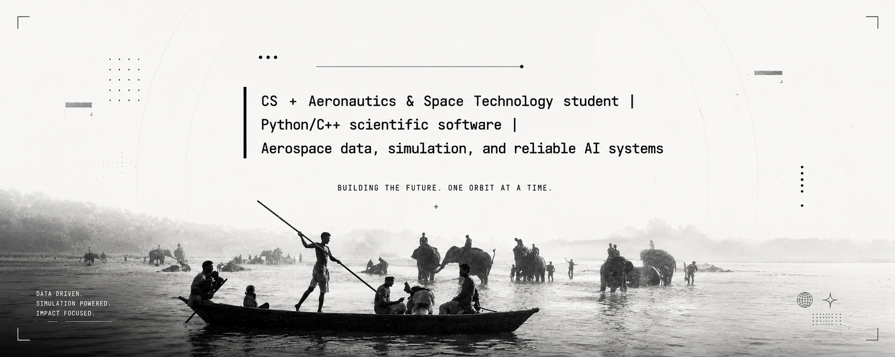

<p align="center">

</p> <p align="center">
  <strong>ENGINEERING THE INTERSECTION OF FLIGHT, CODE, AND DATA.</strong>
</p> <p align="center">
  <a href="https://github.com/sundaramvdubey"></a>
  <a href="https://www.linkedin.com/in/sundaramvdubey">
</p>

```
┌──────────────────────────────────────────────────────────────────────────────┐
│  FLIGHT PLAN // SUNDARAM V. DUBEY                                            │
├──────────────────────────────────────────────────────────────────────────────┤
│  VECTOR  :  Aeronautics & Space Technology + Computer Science                │
│  ALTITUDE:  IIT Madras & MGKVP                                               │
│  RADAR   :  AI-driven programming, data analytics, and technical learning    │
│  STATUS  :  Building systems. Studying models. Following the signal.         │
└──────────────────────────────────────────────────────────────────────────────┘
```

## `01` // About the Engineer

I am, **18, a technology enthusiast** working with **aeronautics, space technology, programming, and data**. My academic path combines a **B.S. in Aeronautics and Space Technology at IIT Madras** with Bsc in Computer science from **MGKVP**, completed a AI-driven data analytics and programming through **IIT Mandi**'s Himshikhar program.

I enjoy turning technical curiosity into structured experiments: writing software, exploring datasets, building visual explanations, and learning how complex systems behave. Outside the lab, I am an artist at heart and a reader of fictional worlds.

> **Operating principle:** Build with precision. Learn continuously. Keep the system observable.


## `02` // The Technical Stack

<p align="left">

  
  
</p>

My preferred workflow is deliberately compact: **C and C++** for fundamentals and performance-oriented thinking; **Python** for analysis and experimentation; **NumPy, Pandas, and Matplotlib** for scientific data work; and **Supabase** for practical application backends and structured storage.

## `03` // Featured Expedition

### [Finsight](https://github.com/sundaramvdubey/Finsight)

> **The UPI Growth Story** : a data-driven exploration of fintech strategy, SQL, and financial modelling designed to turn a large-scale payments question into decision-ready insight.

## `04` // Development Log

```
[■■■■■■■■■■■■■■■■■■■■]  AERONAUTICS & SPACE TECHNOLOGY
[■■■■■■■■■■■■■■■□□□]  COMPUTER SCIENCE FOUNDATIONS
[■■■■■■■■■■■■■■□□□]  DATA ANALYTICS & VISUALIZATION
[■■■■■■■■■■■■■□□□□□]  SYSTEMS-ORIENTED BUILDING
```

I am currently focused on strengthening the fundamentals behind reliable technical work.

</p> <p align="center">
</p>
